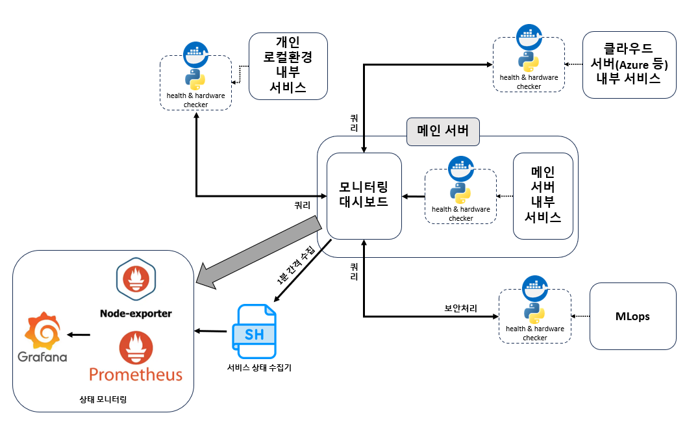

# 개발 2부 산출물 & 개발 문서 배포 페이지

## 테스트 & 운영 중인 배포 서비스 모니터링

### How to use
해당 레포에서 수행되는 모니터링 방식은 아래 그림과 같습니다.


**프로세스**
1. 모니터링 환경 설정
    - 서비스가 실행되고 있는 환경 내에 repo 클론 수행
    - `docker-compose.yml` 주석 확인 후, 배포하고자 하는 서비스의 실행환경에 따라 코드 주석 처리 해제 또는 유지
    - `config.py`에 서비스가 실행되는 환경의 ip 주소와, 배포하고자 하는 서비스의 포트 번호 입력
2. `docker-compose.yml` 실행
    ```
    cd ~/dev2-output-asset-deploy
    docker-compose up
    ```

**모니터링 환경 설정**

`Windows` 운영체제 또는 `Azure Cloud Server` 의 경우 방화벽 인바운드 규칙을 먼저 설정하여야 합니다

- `Windows`
    ```
    1. Windows defender 방화벽 열기
    2. 고급 설정
    3. 인바운드 규칙
    4. 새 규칙
    5. 포트
    6. 특정 포트: 8015 설정
    7. 연결 허용
    8. 프로필 전체 설정
    ```

- `Azure Cloud Server`
    ```
    1. Azure 포털 접속
    2. 네트워킹 -> 네트워크 설정
    3. 포트 규칙 만들기 -> 인바운드 포트 규칙
    4. 대상 포트범위: 8015
    5. 포트 우선순위 제일 후순위로 설정
    ```

